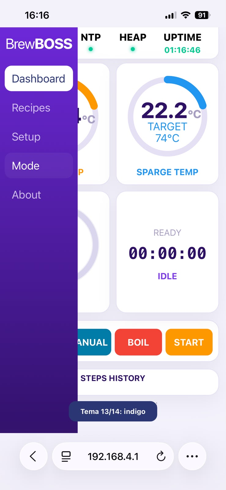
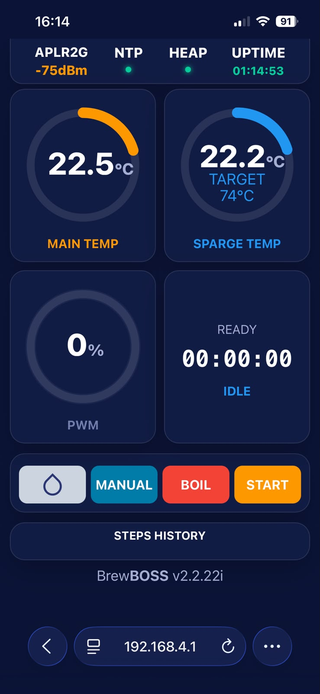
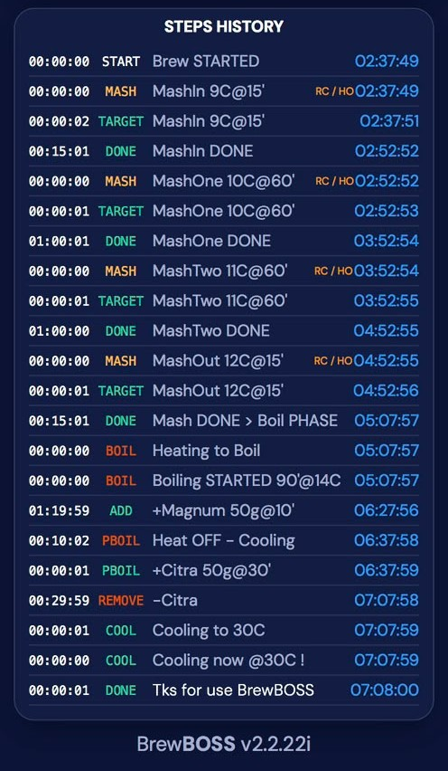
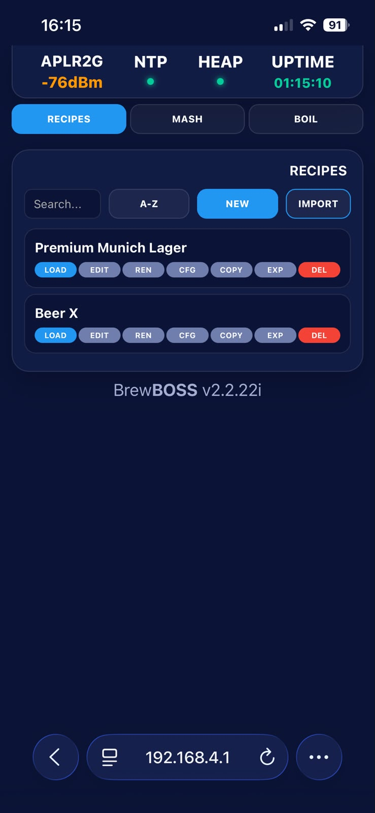
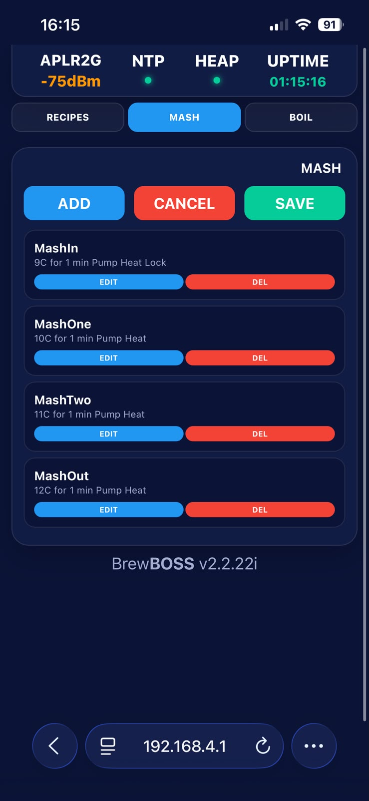
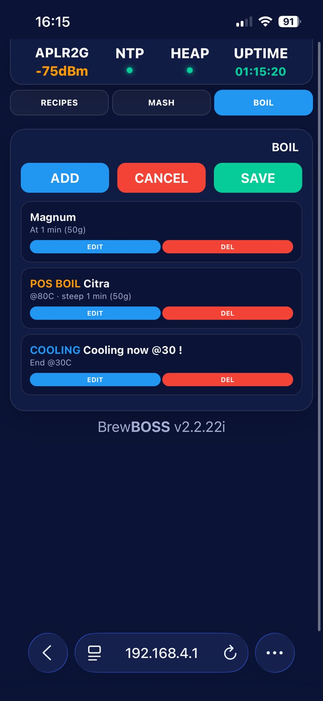
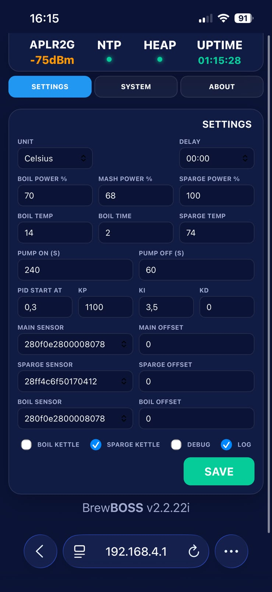
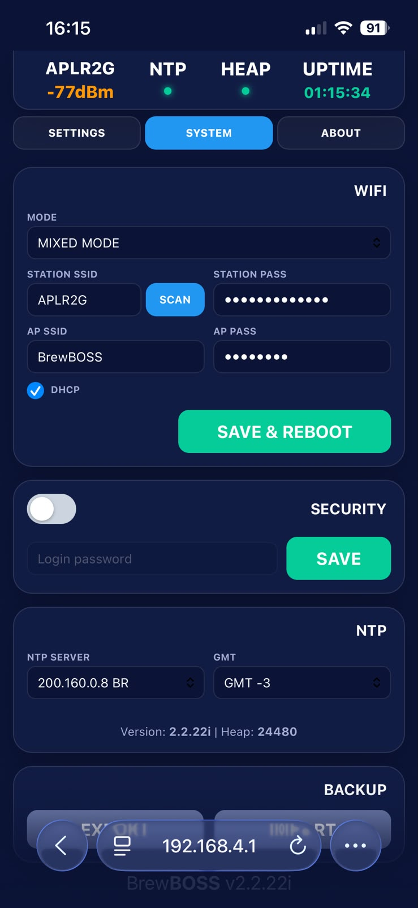
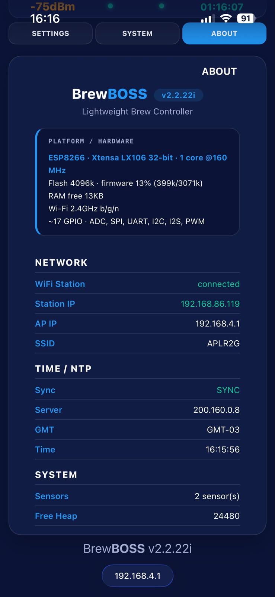
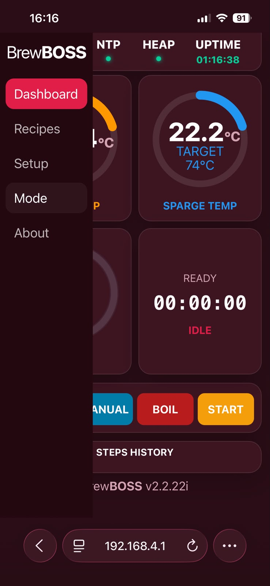

# BrewBOSS — Brew Controller `v2.2.22i`

Brew controller for **ESP8266 / ESP32 / ESP32-C3** — control via web UI, 20×4 LCD or physical buttons.

> 🌐 **Full 9‑language interactive manual:** https://rampanelli.github.io/BrewBOSS/
> 📦 **Binaries for download:** [`binaries/`](binaries/)

---

## Overview

BrewBOSS is a controller for electric brewing equipment. It manages the heaters, pump and timers of a full brew day, and reports temperatures and progress in real time.

**You can operate it in three ways:** web interface (a single page served by the device), stand-alone with the 20×4 LCD and 4 buttons (no network needed), or via the REST API.

**Key capabilities:**
- Programmable **mash** steps, automatic **boil** with timed hop additions, and a **post‑boil** stage with temperature‑triggered additions and final cooling.
- Fully **manual** mode (direct power) or **pre‑programmed recipes**.
- Recipe management (create, edit, save, activate, delete, import) — compatible with tools like BeerSmith / Brewfather.
- Temperature log (CSV) ready for detailed mash graphs.
- **Automatic power‑loss recovery** — continues where it stopped.
- **Safety system** (over‑temperature cut‑off and sensor‑loss cut‑off).
- Works online or offline; status displayed on a 20×4 LCD.

**Hardware:** runs on ESP8266 (Wemos), ESP32 and ESP32‑C3. 100% compatible with wiring used by BrewManiac and BrewUNO — just flash and use.

---

## Prerequisites

- A supported controller board with the BrewBOSS firmware.
- Brewing hardware: heater(s) via SSR, a pump, one or more **DS18B20** temperature sensors. Optional 20×4 I²C LCD + 4 buttons.
- A phone, tablet or computer with a web browser.
- Optionally, your home Wi‑Fi network.

---

## Accessing the system

1. **Power on** the controller.
2. **Connect to its access point** — default network `BrewBOSS`, password `brewboss`, IP `192.168.4.1`.
3. Open `http://192.168.4.1` in a browser.

**Login:** optional, based on a single password (default `brewboss`). Correct password → full access. IGNORE → read‑only. Wrong password → up to 10 retries.

Change or disable the password in **Setup → System → Security**. Re‑flashing the filesystem resets it to `brewboss`.

**Wi‑Fi modes:** `AP` (the device is its own network), `STATION` (joins your router), `MIXED` (both). In STATION mode, if no connection within 60 s it falls back to the access point.

---

## Navigating the interface

<table border="0"><tr><td style="vertical-align:top;padding-right:16px;">

The interface has a **side menu** and a **status bar** at the top.

- **Dashboard** — live temperatures, gauges, timer and control buttons.
- **Recipes** — recipe library and mash/boil step editors.
- **Setup** — Settings, System (network, security, time, backup) and About.
- **Mode** — switches the color theme.
- **About** — version and hardware information.

**Status bar:** Wi‑Fi indicator (signal or AP name), NTP dot, HEAP dot, UPTIME.

Tap the status bar to collapse/expand the menu (useful on phones).

</td><td width="260"></td></tr></table>

---

## Step‑by‑step operation

1. **Prepare** — fill the kettle, place sensors, connect to the interface.
2. **Choose a recipe** — open Recipes, activate one.
3. **Check settings** — in Setup → Settings, confirm unit, temperatures and sensors.
4. **Start the mash** — press Start on the Dashboard.
5. **Follow along** — watch the gauges and Steps history.
6. **Boil** — after the last mash step the system moves to the boil automatically.
7. **Post‑boil & cooling** — heating off, temperature‑based additions, final cooling.
8. **Finish** — the buzzer signals the end and the total brew time is shown.

> **Scheduled start (Delay):** schedule the mash or boil to begin later. The LCD shows a countdown and starts on its own.

---

## The screens

### Dashboard (Main)

<table border="0"><tr><td style="vertical-align:top;padding-right:16px;">

The home screen with three round gauges (main temperature, sparge temperature, power/PWM) and the brew timer with the current step name. **Use the control buttons below the gauges** to run the brew (Start, Pause/Resume, Stop, Skip). During manual mode you can tap a gauge to set the target temperature or power.

</td><td width="260"></td></tr></table>

### Step view & Steps history

<table border="0"><tr><td style="vertical-align:top;padding-right:16px;">

A running timeline of every milestone: start, target reached, step changes, hop additions, completion — all time‑stamped and color‑coded.

</td><td width="260"></td></tr></table>

### Recipes

<table border="0"><tr><td style="vertical-align:top;padding-right:16px;">

Your recipe library with search, sort and Import. Activate a recipe to load it for brewing; import recipes saved elsewhere; save, edit and delete your own.

</td><td width="260"></td></tr></table>

### Mash steps editor

<table border="0"><tr><td style="vertical-align:top;padding-right:16px;">

Define your mash profile step by step. Each step has a name, target temperature, duration (minutes) and flags: **Recirculate** (run pump), **Heater on**, **Full power**, **Step‑lock** (pause for manual action).

</td><td width="260"></td></tr></table>

### Boil steps & additions editor

<table border="0"><tr><td style="vertical-align:top;padding-right:16px;">

Schedule hop additions during and after the boil. Trigger types: timed addition (during boil), post‑boil addition (by temperature), or final cooling.

</td><td width="260"></td></tr></table>

### Settings

<table border="0"><tr><td style="vertical-align:top;padding-right:16px;">

Brew parameters: unit (°C/°F), delay, power percentages, boil temperature/time, sparge, PID band, pump timing, sensor assignments and checkboxes. **Use sensor offsets** to calibrate against a reference thermometer.

</td><td width="260"></td></tr></table>

### System (network, security, time, backup)

<table border="0"><tr><td style="vertical-align:top;padding-right:16px;">

Wi‑Fi mode and credentials, Security (login on/off and password), NTP server and GMT offset, and Backup (export/import your configuration).

</td><td width="260"></td></tr></table>

### About

<table border="0"><tr><td style="vertical-align:top;padding-right:16px;">

Firmware version, hardware info, network status, time/NTP and system info — the data to include when asking for help.

</td><td width="260"></td></tr></table>

### Color themes (Mode)

<table border="0"><tr><td style="vertical-align:top;padding-right:16px;">

Tap **Mode** in the side menu to cycle through the available color schemes — for example a dark theme for a dim brew room.

</td><td width="260"></td></tr></table>

---

## Control buttons (Dashboard)

| Button | Action |
|---|---|
| <kbd>Start</kbd> | Begins the mash |
| <kbd>Pause</kbd> / <kbd>Resume</kbd> | Pauses and resumes |
| <kbd>Stop</kbd> | Stops everything |
| <kbd>Skip</kbd> | Skips the current mash step |
| <kbd>Boil</kbd> | Starts the boil directly |
| <kbd>Pump</kbd> | Turns the pump on/off |
| <kbd>Prime</kbd> | Runs an automatic priming cycle (5 × 3 s on / 2 s off) |

---

## Status indicators

- **Wi‑Fi:** signal strength in dBm when joined to a network, or **AP** (green) with the access‑point name.
- **NTP dot:** green when the clock is synchronized.
- **HEAP dot:** free memory health.
- **UPTIME:** how long the device has been running.

The **Steps history** and LCD show events — from *Brew STARTED* through to completion. A **SAFETY** event with an alarm means a protection was triggered.

---

## Operation modes

- **Mash** — runs your programmed mash steps; auto‑advances to boil.
- **Boil** — heats to boiling, runs the timer, fires timed additions. Can be started alone.
- **Post‑boil** — heating off; monitors cooling, triggers temperature‑based additions, then final cooling.
- **Manual** — direct heater power setting (open loop). The target is informational only. Not saved for recovery.
- **Delay (scheduled start)** — start the mash or boil with a delay; the device counts down and begins on its own.

**Pump** — switch on/off manually; during a recirculation step it is controlled automatically.
**Prime** — automatic cycle to fill the plumbing before you start.

---

## Standalone use — LCD & physical buttons

You can run a whole brew without the web interface.

### The 20×4 display

```
[w] BrewBOSS 00:14:32          ← Wi‑Fi icon + title + step timer
[H]  65.20>66  [W] 68% [P]      ← Main: current>target, power, PWM, pump
[S]  74.00>74  100%         M   ← Sparge: current>target, PWM, flag B/M/L
Add Citra 30g@15'              ← last event message (or IP / AP)
```

- **Line 1** — Wi‑Fi icon + "BrewBOSS" with the step timer while brewing; otherwise the version.
- **Line 2** — main temperature (current > target), unit, heater power, PWM% and a pump icon when on.
- **Line 3** — sparge temperature and its PWM%; a flag: **B** (boil paused), **M** (mash paused) or **L** (step locked).
- **Line 4** — the last event message; when idle it shows `IP: <address>` or `AP: 192.168.4.1`.

After a brew completes, the screen shows a thank‑you for 15 s and then the total brew time until you press any button.

### The 4 buttons

The four membrane‑keypad buttons are numbered **1–4**. Each reacts to three press lengths: **short**, **long** (~2 s) and **very long** (~3 s).

| Press | 1 | 2 | 3 | 4 |
|---|---|---|---|---|
| **Short** | Pump on/off | Power **−10%** | Power **+10%** | Pause / Resume |
| **Long** (~2 s) | **Prime** | Start **manual** / skip step / unlock | Start **boil** | Start **mash** |
| **Very long** (~3 s) | — | Stop | Stop | Stop |

- The ±10% power change affects the active heater for the current mode.
- In the mash, a long press on **button 2** skips the current step; if the step is locked, the same long press unlocks and advances it.
- On the total‑time screen after completion, any button returns to the home screen.

### Buzzer

| When | Sound |
|---|---|
| Target temperature reached | Two long beeps |
| Mash step advances | Short–short–long |
| Boil starts / hop addition | Two short + two long |
| Step locked (needs action) | Two beeps every 15 s |
| Brew complete | Four long beeps |
| Safety triggered | Alarm pattern |

---

## Power‑loss recovery

If power is lost during a brew, on restart the device detects the saved state, **enters PAUSE** and shows **"RECOVERED! RESUME?"** on the LCD. Press **button 4 (short)** to resume where it stopped.

If the clock was synchronized, the remaining time is adjusted for the off‑time. Manual mode is not recovered.

---

## Main usage flow (quick reference)

1. Power on → connect to `BrewBOSS` / open `192.168.4.1` → log in.
2. **Recipes** → activate your recipe.
3. **Settings** → confirm unit, temperatures and sensors.
4. **Dashboard** → Prime (optional) → Start.
5. Mash runs → **Boil** → additions fire on time.
6. **Post‑boil** / cooling → **Complete** (total time shown).

---

## Best practices

- Calibrate sensor **offsets** against a trusted thermometer before your first brew.
- Run **Prime** and confirm flow before starting the mash.
- Keep the device on a **trusted Wi‑Fi** network — the connection carries the password in clear text locally.
- Save your brews as **recipes** and use the temperature **log/CSV** to fine‑tune them for your equipment.
- Make a **Backup** (Export) after configuring the device.
- Keep the area near the heaters clear; never leave an active brew fully unattended.

---

## Troubleshooting

| Symptom | Likely cause & what to do |
|---|---|
| Cannot open `192.168.4.1` | Make sure you are joined to the `BrewBOSS` network. Use `http://192.168.4.1`. On phones, dismiss any "no internet" prompt. |
| Access point is unstable | In MIXED mode, the AP can flicker up to 60 s while trying to reach an unreachable Wi‑Fi, then stabilizes. Or use AP‑only mode. |
| A temperature shows `---` | That sensor is not detected or is disconnected. Check wiring and re‑assign the sensor in Settings. |
| Heaters won't turn on / "SAFETY" event | Over‑temperature or sensor loss in auto mode. Let it cool / fix the sensor; heating resumes when safe. |
| Cannot make changes (read‑only) | You are in read‑only mode. Tap the "Read‑only — tap to login" badge and enter the password. |
| Forgot the password | Re‑flash the filesystem to reset the password to `brewboss`. |
| Wrong time on logs | Set an NTP server and GMT offset in System. |
| After a power cut it is paused | That is the recovery feature. Press button 4 (short) to resume. |

---

## Firmware & installation

Firmware (LittleFS shipped separately) for the 3 supported controllers. Filesystem images are in **LittleFS** format.

### Files and offsets

| Controller | File | Type | Offset | Size |
|---|---|---|---|---|
| **Wemos** ESP8266 | `fw-wemos_v2.2.22i.bin` | Firmware | `0x00000000` | 408,880 B |
| | `littlefs-wemos_v2.2.22i.bin` | LittleFS | `0x00300000` | 1,024,000 B |
| **ESP32** esp32dev | `fw-esp32_v2.2.22i.bin` | Firmware | `0x00010000` | 984,608 B |
| | `littlefs-esp32_v2.2.22i.bin` | LittleFS | `0x00290000` | 1,441,792 B |
| **ESP32‑C3** | `fw-esp32c3_v2.2.22i.bin` | Firmware | `0x00010000` | 995,744 B |
| | `littlefs-esp32c3_v2.2.22i.bin` | LittleFS | `0x00290000` | 1,441,792 B |

### Prerequisites
- Install esptool: `pip install esptool`
- Connect the controller via USB and find its serial port.
- Run the commands from the folder where the `.bin` files are.

### Flashing (update)
Flash the firmware first, then the filesystem — two separate steps (more reliable):

**Wemos / ESP8266 — firmware**
```bash
esptool.py --chip esp8266 --port COMx --baud 460800 write_flash 0x0 fw-wemos_v2.2.22i.bin
```
**Wemos / ESP8266 — filesystem**
```bash
esptool.py --chip esp8266 --port COMx --baud 460800 write_flash 0x300000 littlefs-wemos_v2.2.22i.bin
```
**ESP32 — firmware**
```bash
esptool.py --chip esp32 --port COMx --baud 460800 write_flash 0x10000 fw-esp32_v2.2.22i.bin
```
**ESP32 — filesystem**
```bash
esptool.py --chip esp32 --port COMx --baud 460800 write_flash 0x290000 littlefs-esp32_v2.2.22i.bin
```
**ESP32-C3 — firmware**
```bash
esptool.py --chip esp32c3 --port COMx --baud 460800 write_flash 0x10000 fw-esp32c3_v2.2.22i.bin
```
**ESP32-C3 — filesystem**
```bash
esptool.py --chip esp32c3 --port COMx --baud 460800 write_flash 0x290000 littlefs-esp32c3_v2.2.22i.bin
```

> **ESP8266:** the firmware already includes the bootloader (eboot), so it is written at `0x0`.

### Blank chip (ESP32 / ESP32‑C3)
Also flash the bootloader, partition table and boot_app0.

**ESP32 — bootloader at 0x1000**
```bash
esptool.py --chip esp32 --port COMx --baud 460800 write_flash 0x1000 bootloader.bin 0x8000 partitions.bin 0xe000 boot_app0.bin 0x10000 fw-esp32_v2.2.22i.bin 0x290000 littlefs-esp32_v2.2.22i.bin
```
**ESP32-C3 — bootloader at 0x0**
```bash
esptool.py --chip esp32c3 --port COMx --baud 460800 write_flash 0x0 bootloader.bin 0x8000 partitions.bin 0xe000 boot_app0.bin 0x10000 fw-esp32c3_v2.2.22i.bin 0x290000 littlefs-esp32c3_v2.2.22i.bin
```

> **Erase everything first (optional):** `esptool.py --chip <esp32|esp32c3|esp8266> --port COMx erase_flash`.

---

## Notes

- Offsets are valid for the current partition table (4 MB flash). If the table changes, the offsets change.
- Images are **LittleFS** (not SPIFFS).
- ESP32‑C3 with native USB: the port appears as an Espressif serial device (VID `303A`); reset/boot for flashing is automatic.
- **License:** personal / non‑commercial use only.

<br>

<details>
<summary><b>License &amp; Terms of Use</b></summary>

# BrewBOSS License Agreement
Version 1.0

Copyright (c) 2026 LR

## 1. Grant of Use
This software, named **BrewBOSS**, is made available **free of charge** strictly for **personal, private, and non‑commercial use only**. Subject to the terms, you are permitted to: download and use for personal use; inspect source code; modify for personal use only; make private copies for backup.

## 2. Prohibited Uses
Forbidden without prior written permission: selling, reselling, sublicensing or commercializing; using in any commercial, industrial, corporate or revenue‑generating activity; embedding into products for sale; distributing for commercial purposes; using in production or industrial environments; removing this license notice. Any use outside personal, non‑commercial use is prohibited.

## 3. No Warranty
PROVIDED "AS IS", WITHOUT WARRANTY OF ANY KIND, EXPRESS OR IMPLIED. The copyright holder and contributors make no warranties of merchantability, fitness, non‑infringement, accuracy, reliability, compatibility, continuous operation, or that the software is error‑free or safe.

## 4. Safety and Operational Risk
The user acknowledges that the software may contain defects, may stop working, may behave unpredictably, may interact with hardware unsafely, and is not certified for safety or critical operations. The user assumes all risks.

## 5. Limitation of Liability
IN NO EVENT SHALL THE COPYRIGHT HOLDER, AUTHORS OR CONTRIBUTORS BE LIABLE FOR ANY CLAIM, LOSS, DAMAGE, COST OR LIABILITY OF ANY KIND, WHETHER DIRECT, INDIRECT, INCIDENTAL, SPECIAL, CONSEQUENTIAL OR OTHERWISE. This includes loss of data, file corruption, equipment malfunction, hardware damage, electrical damage, overheating, fire, personal injury, loss of profits, business interruption, production loss, and any other damages.

## 6. No Support
No obligation to provide technical support, updates, bug fixes, maintenance, security patches, compatibility changes or documentation updates. Any voluntary support does not create a continuing obligation.

## 7. Termination
Any violation automatically terminates your right to use the software. Upon termination, stop using and delete all copies.

## 8. Acceptance
By downloading, installing, copying, modifying, accessing or using BrewBOSS, you agree to be bound by this license. If you do not agree, do not use the software.

</details>
